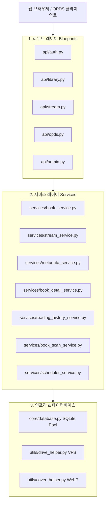
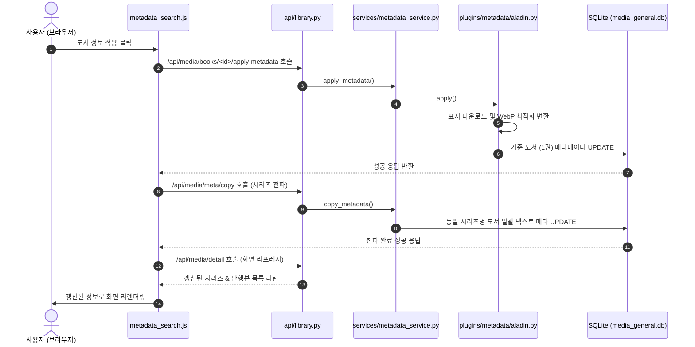

# 🏗️ BookOasis 아키텍처 및 레이어별 구성 가이드 (Architecture Guide)

이 문서는 BookOasis 미디어 서버의 아키텍처 설계와 각 소스코드 레이어별 역할, 핵심 클래스 및 함수, 그리고 데이터 흐름에 대해 상세히 기술합니다.

---

## 1. 아키텍처 개요 (Architecture Overview)

BookOasis는 극도로 정제된 **3-Tier 계층 아키텍처(Layered Architecture)**를 따르고 있습니다. Flask의 기본 Blueprints 기능을 통해 웹 라우터를 분리하고, 비즈니스 로직을 `services` 디렉토리의 도메인 서비스들로 분할하여 독립성을 보장합니다.

---

## 2. 레이어별 상세 설명 (Layer Details)

### 📌 1) 라우트 레이어 (Route Layer)
클라이언트의 HTTP 요청을 직접적으로 수신하고 파라미터를 검증하여 적절한 서비스(Service) 메서드를 트리거하는 관문 역할을 합니다. `api/` 디렉토리에 위치해 있습니다.

* **`api/auth.py` (인증 관리)**
  * **역할**: 로그인 세션 수립, 비밀번호 변경, 최초 설치 여부 판단 등을 제어합니다.
  * **주요 엔드포인트**:
    * `/api/auth/login` (POST): 아이디/비밀번호 검증 및 세션(`user_id`, `role`) 등록.
    * `/api/auth/change-password` (POST): 기존 세션 확인 후 사용자 비밀번호 안전 갱신.
* **`api/library.py` (라이브러리 통제)**
  * **역할**: 대시보드 데이터 공급, 시리즈 상세 조회, 메타데이터 연동 제어, 스캐너 호출 등을 처리합니다.
  * **주요 엔드포인트**:
    * `/api/media/detail` (GET): 특정 시리즈 상세 조회 API (`BookDetailService` 연동).
    * `/api/media/books/<id>/apply-metadata` (POST): 수동 매칭 데이터 적용 (`MetadataService` 연동).
* **`api/stream.py` (미디어 스트리밍)**
  * **역할**: 만화 뷰어 및 EPUB 뷰어가 요청한 특정 도서의 이미지/파일 바이트를 실시간으로 인코딩하여 전송합니다.
  * **주요 엔드포인트**:
    * `/api/stream/book/<id>/page/<page_num>` (GET): 압축 파일 내 특정 이미지 페이지만 압축 해제 없이 버퍼링 스트리밍 (`StreamService` 연동).
* **`api/opds.py` (OPDS 무선 피드)**
  * **역할**: 외부 뷰어 애플리케이션(Basic Auth 필수)에 XML Atom 피드 규격 카탈로그 및 물리 도서 다운로드 서비스를 연동합니다.

---

### 📌 2) 서비스 레이어 (Service Layer)
도메인의 실질적인 비즈니스 로직이 집중되어 있는 순수 파이썬(Plain Python) 모듈 레이어입니다. 데이터베이스 세션을 제어하고 알고리즘을 수행합니다. `services/` 디렉토리에 위치해 있습니다.

* **`services/stream_service.py` (`StreamService`)**
  * **역할**: 대용량 ZIP/CBZ 파일을 디렉토리에 미리 해제하지 않고, 내장 `zipfile` 모듈을 제어하여 요청된 특정 페이지 이미지 바이트만 온메모리(On-Memory) 상태에서 바이트 오프셋으로 추출하여 즉시 전송합니다.
  * **주요 함수**:
    * `get_page_stream(book_id, page_index)`: 파일 포맷을 식별하여 해당 만화 페이지 이미지 파일 바이트와 마임 타입(MIME-Type)을 리턴합니다.
* **`services/book_detail_service.py` (`BookDetailService`)**
  * **역할**: 시리즈 상세 화면에 필요한 메타 정보 및 속한 전체 단행본 리스트를 데이터베이스로부터 쿼리합니다.
  * **주요 함수**:
    * `get_media_detail(db_type, series_name, library_id)`: 전달된 식별자를 기반으로 도서 목록과 독서 진행 상태(`pages_read`)를 조인하여 결과를 리턴합니다.
* **`services/metadata_service.py` (`MetadataService`)**
  * **역할**: `metadata_factory`에 의해 동적으로 로드된 알라딘 등 플러그인 인스턴스를 조율하여 정보를 도서에 주입하고, 시리즈 내 모든 도서로 텍스트 메타데이터를 전파합니다.
  * **주요 함수**:
    * `apply_metadata(db_type, book_id, item_data, source)`: 특정 도서 레코드에 메타데이터 정보 갱신 및 표지 이미지(WebP) 다운로드 실행.
    * `copy_metadata(db_type, target_series, target_lib_id, source_book_id)`: 기준 도서의 텍스트 메타데이터를 동일 시리즈 내의 전체 단행본에 일괄 덮어쓰기 복사 전파.
* **`services/book_scan_service.py` (`BookScanService`)**
  * **역할**: 스캐너 백그라운드 태스크 제어, 특정 보관함 재스캔 및 rclone VFS 캐시 갱신 API와 동기화를 총괄합니다.

---

### 📌 3) 인프라 및 인프라 어댑터 레이어 (Infrastructure Layer)
데이터베이스 및 네트워크, 파일 저장소 등의 실제 물리 자원 및 외부 인프라를 연결하는 모듈입니다.

* **`core/database.py` (SQLite Connection Pool)**
  * **역할**: 파이썬 표준 `sqlite3` 모듈에 **스레드 세이프(Thread-Safe) 커넥션 풀링(Pooling)** 아키텍처를 직접 구축하여, 고성능 멀티스레드 환경에서도 데이터 베이스 잠금(`database is locked`) 에러가 발생하지 않도록 락을 제어합니다.
* **`utils/drive_helper.py` (VFS Controller)**
  * **역할**: 대용량 구글 드라이브(2PB 이상) 스캔 시 rclone 마운트의 오버헤드를 막기 위해, 변경된 디렉토리 경로에 대해서만 정밀 핀포인트 캐시 퍼징(`rclone rc vfs/refresh`)을 트리거합니다.
* **`utils/cover_helper.py` (Pillow WebP Optimizer)**
  * **역할**: 알라딘 등 메타 검색을 통해 획득한 고화질 원본 이미지(PNG/JPG)를 저장할 때 `Pillow` 라이브러리를 이용하여 고압축 **WebP** 포맷으로 트랜스코딩 처리하여 저장함으로써 네트워크 대역폭 및 디스크 용량을 최적화합니다.

---

## 3. 핵심 시퀀스 데이터 흐름 (Core Data Flow)

### 🔄 메타데이터 수동 매치 및 시리즈 일괄 전파 흐름

