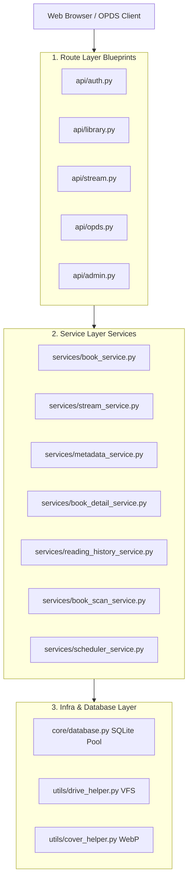
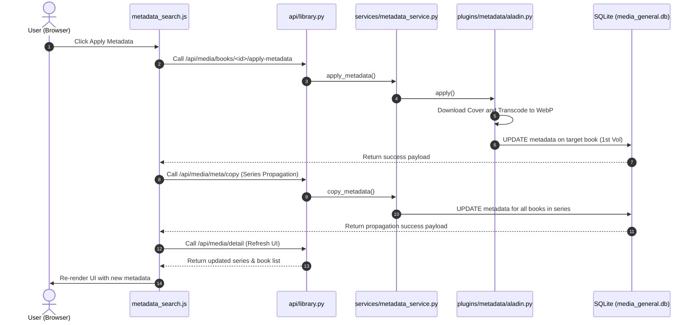

# 🏗️ BookOasis Architecture and Layered Structure Guide (Architecture Guide)

This document describes the architectural design of the BookOasis media server, the roles of each source code layer, key classes and functions, and the sequence of data flow.

---

## 1. Architecture Overview

BookOasis follows a highly refined **3-Tier Layered Architecture**. The web router is separated through Flask's built-in Blueprints, and the business logic is split into domain services under the `services` directory to guarantee independence.

---

## 2. Detailed Layer Description

### 📌 1) Route Layer
This layer receives HTTP requests from clients, validates parameters, and triggers appropriate domain service methods. It is located in the `api/` directory.

* **`api/auth.py` (Authentication Control)**
  * **Role**: Manages login session establishment, password modification, and checking if initial setup is complete.
  * **Key Endpoints**:
    * `/api/auth/login` (POST): Validates credentials and registers session keys (`user_id`, `role`).
    * `/api/auth/change-password` (POST): Modifies user password securely after validating active session.
* **`api/library.py` (Library Control)**
  * **Role**: Feeds dashboard data, retrieves series details, updates metadata, and handles scanner triggering.
  * **Key Endpoints**:
    * `/api/media/detail` (GET): Detailed series retrieval API (`BookDetailService`).
    * `/api/media/books/<id>/apply-metadata` (POST): Applies manually matched book metadata (`MetadataService`).
* **`api/stream.py` (Media Streaming)**
  * **Role**: Encodes and transmits image or file bytes requested by the viewer in real-time.
  * **Key Endpoints**:
    * `/api/stream/book/<id>/page/<page_num>` (GET): Streams a specific page image from compressed archive without extracting (`StreamService`).
* **`api/opds.py` (OPDS Wireless Feed)**
  * **Role**: Connects external viewer apps (Basic Auth required) to Atom XML catalog feeds and handles book file downloads.

---

### 2) Service Layer
This is a pure python layer where the actual business logic of the domain is concentrated, controlling DB transactions and running backend algorithms. It is located in the `services/` directory.

* **`services/stream_service.py` (`StreamService`)**
  * **Role**: Leverages python's built-in `zipfile` module to extract specific page image bytes on-memory using byte offsets, streaming data without pre-extracting large ZIP/CBZ archives.
  * **Key Functions**:
    * `get_page_stream(book_id, page_index)`: Identifies file format and returns image bytes with the matching MIME-Type.
* **`services/book_detail_service.py` (`BookDetailService`)**
  * **Role**: Queries series metadata and the matching list of books from the SQLite database.
  * **Key Functions**:
    * `get_media_detail(db_type, series_name, library_id)`: Joins book rows with user reading progress (`pages_read`) and returns the payload.
* **`services/metadata_service.py` (`MetadataService`)**
  * **Role**: Orchestrates plugin instances (like Aladin) loaded dynamically by `metadata_factory` and copies text metadata across all books inside the series.
  * **Key Functions**:
    * `apply_metadata(db_type, book_id, item_data, source)`: Updates metadata for a specific book and downloads optimized WebP cover image.
    * `copy_metadata(db_type, target_series, target_lib_id, source_book_id)`: Overwrites metadata parameters for all books in the series using a single source book.
* **`services/book_scan_service.py` (`BookScanService`)**
  * **Role**: Controls background scanner tasks and synchronizes rclone VFS refreshing.

---

### 3) Infrastructure Layer
An adapter layer connecting raw system assets, database connections, and external file storage interfaces.

* **`core/database.py` (SQLite Connection Pool)**
  * **Role**: Implements a custom thread-safe SQLite connection pooling architecture to avoid database locking (`database is locked`) errors under concurrent read/write Flask threads.
* **`utils/drive_helper.py` (VFS Controller)**
  * **Role**: Triggers pinpoint cache purging (`rclone rc vfs/refresh`) on directories to preserve system performance when scanning large remote storage drives.
* **`utils/cover_helper.py` (Pillow WebP Optimizer)**
  * **Role**: Uses `Pillow` library to transcode high-resolution cover images (PNG/JPG) to highly compressed **WebP** formats, optimizing network traffic and storage space.

---

## 3. Core Sequence Data Flow

### 🔄 Manual Metadata Match and Series Propagation Flow

